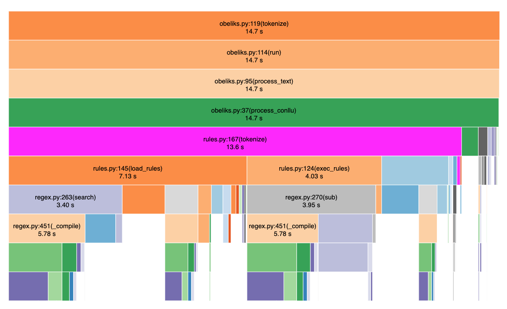

# CLASSLA LAB

Here is a lab environment focused on benchmarking & profiling `classla` NLP processors. The benchmarks based on `spacy`
technology are also implemented for study and comparison. The idea behind this repository is to provide a reference
environment where the performance of classla processors can be analyzed and perhaps optimized (in future phases). Only
inference (prediction) pipelines are analyzed.

The resulting observations are discussed at the end of this doc.

## Installation

```bash

# install project
git clone https://github.com/IgorTavcar/classla_lab
cd classla_lab
python3 -m venv env
source env/bin/activate
python3 -m pip install -r requirements.txt 

```

## Setup

sh scripts/setup.sh

## Data

The folder `data/text` contains two files `raw-en.txt` and `raw-slo.txt`. which are used as input in benchmark and
profile sessions. Each file contains text from a novel and two web articles with the same content in `sl` and `en`
languages. The files are formatted in '1 paragraph per line' format, the lines are shuffled (to avoid copyright issues)
and are not aligned.

## Benchmarking

```bash
# quick benchmarks (short-lasting)
sh scripts/bm_quick.sh

# run all benchmarks 
sh scripts/bm_all.sh

# classla (lstm) vs spacy (transformers) benchmarks
sh scripts/bm_quick_trf.sh
sh scripts/bm_all_trf.sh

```

Classla benchmarks are based on the `lstm` backbone (except for sentence tokenization which is based on  `regex`). Spacy
benchmarks are based on the `tok2vec` backbone, `*_trf` benchmarks are based on the `transformers` backbone. Benchmark
reports are at `var/bm/reports`.

## Profiling

```bash
# method: cProfile
# use option --interactive for interactive sessions (snakeviz) 

# run all profiles
sh scripts/profile_all.sh

# profile classla pipeline 'tokenize,pos,lemma'
sh scripts/profile_lem_classla.sh
sh scripts/profile_lem_classla_quick.sh

# profile classla pipeline 'tokenize,lemma' + lemma-identity
sh scripts/profile_lem_classla_idl_quick.sh

# profile classla pipeline 'tokenize,ner'
sh scripts/profile_ner_classla.sh
sh scripts/profile_ner_classla_quick.sh

# profile classla pipeline 'tokenize,pos'
sh scripts/profile_pos_classla.sh
sh scripts/profile_pos_classla_quick.sh

# profile classla pipeline 'tokenize'
sh scripts/profile_sent_classla.sh
```

Resulted `*.pstat` files are at `var/bm/profiles`. For (browser based) interactive sessions use option `--interactive` (
see `snakeviz` doc).

## Observations

### Tokenization

The implementation of sentence tokenization in the module `obeliks` is suboptimal. A hotspot was discovered in
the `obeliks.rules.tokenize()` method. The function `load_rules()` is invoked twice for each `tokenize()` call. It would
be better if the rules are loaded and cached during the initialization phase of the processor.


[tokenizer benchmarks (workstation)](results/reports/workstation_00/tok-all-20210619_131409.csv)

[tokenizer benchmarks (laptoop)](results/reports/macbook_00/tok-all-20210619_060714.csv)

#### Comments

[bm_sentences_classla_obeliks_joined_sl()](https://github.com/IgorTavcar/classla_lab/blob/1dfe45cfc4b8040a9df5ca971a50332431e288e8/benchmarks/bm_tok.py#L24)

This benchmark shows the speed of the obeliks tokenizer that would be (approximately) achieved, if the hotspot problem
was fixed.

[bm_sentences_classla_obeliks_batched_sl()](https://github.com/IgorTavcar/classla_lab/blob/1dfe45cfc4b8040a9df5ca971a50332431e288e8/benchmarks/bm_tok.py#L34)

This benchmark is based on the naive assumption that batching is supported by the classla pipeline. But - the tokenizer
processor does not support list-of-strings input, so in this experiment the lines are joined by 'new-line' separators.
This approach does not improve the speed of processing ...

[bm_sentences_classla_reldi_sl()](https://github.com/IgorTavcar/classla_lab/blob/1dfe45cfc4b8040a9df5ca971a50332431e288e8/benchmarks/bm_tok.py#L46)

Reldi tokenizer is much faster than obeliks. The difference in the number of sentences (between the two) is in the range of a few percent.

[bm_sentences_classla_multi_docs_sl()](https://github.com/IgorTavcar/classla_lab/blob/1dfe45cfc4b8040a9df5ca971a50332431e288e8/benchmarks/bm_tok.py#L56)

This invocation will raise for classla versions <= 1.0.1.; multi-docs is a feature of stanza v1.2., but is not implemented in classla~=1.0.1..


### Pipeline

The classla processor pipeline lacks:
* streaming api:`Iterable[str] (YIELD)` - for a sequence of texts to process
* `multiprocessing` support - for parallelizing text processing.
* `multi-documents` support (stanza v1.2.) 

### POS, NER, LEMMA processors

Classla LM processors are based on models with `LSTM` seq2seq architecture. The accuracy of these models is generally better than the accuracy of statistical models, but nevertheless a NLP revolution called **transformers** has occurred in the last 2 years ...


#### Acceleration 

RNN acceleration is no joke. RNN computations involve intra/er/-state dependencies. These lead to poor hardware utilization and low performance. Compare *execution times* of `bm_classla_lemmas_sl()` and `bm_spacy_lemmas_en_trf()` in [lemmatization pipeline benchmarks](results/reports/workstation_00/lem-classla-classla_idl-spacy_trf-20210619_133953.csv).


The maximum GPU load was around 37% (for classla pipelines).

## Discussion

* LM processors based on `transformers` backbone
* Transfer of `classla` models to `spacy` ecosystem


